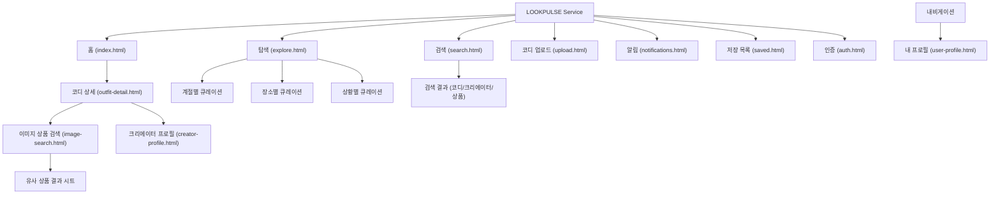

# [PRD] 패션 소셜 커뮤니티 웹 서비스 (Vibe Fashion / 가칭 'LOOKPULSE')

---

## 1. Product Overview (제품 개요)

- **서비스명**: LOOKPULSE (가칭)
- **정의**: 누구나 가볍고 직관적으로 스타일을 발견하고, 코디 속 아이템을 즉각 탐색·검색하며, 크리에이터로 성장할 수 있는 비주얼 중심 패션 소셜 커뮤니티 플랫폼.
- **핵심 컨셉**: "Discover Style, Find the Item, Share Your Look"
- **핵심 가치사슬**: 코디 발견(Feed/Explore) → 지능형 검색(Search/Tag) → 콘텐츠 심층 탐색(Detail) → 이미지 기반 상품 확인(Visual Match) → 소셜 인터랙션(Like/Comment/Save/Follow) → 크리에이터 활동 및 협찬(Creator Economy).

---

## 2. Product Goal (제품 목표)

1. **탐색 피로도 최소화**: 패션 전문 지식이 없어도 계절, TPO(시간·장소·상황) 기반 직관적 큐레이션으로 3초 안에 취향 코디 발견.
2. **콘텐츠-커머스 정보 단절 해소**: 이미지 속 착장 아이템(상의, 하의, 신발, 가방, 액세서리)의 핀포인트 정보 제공 및 유사 상품 매칭률 90% 이상 체감 제공.
3. **오가닉 크리에이터 생태계 구축**: 일반 사용자가 업로드 3단계(사진 등록 → TPO 선택 → 상품 태그)만으로 손쉽게 크리에이터로 전향할 수 있는 환경 제공 및 협찬 뱃지/배너 구조 표준화.
4. **유연하고 트렌디한 디자인 아키텍처**: 매년 Pantone Color of the Year를 단일 CSS 변수 수정만으로 전사 적용할 수 있는 테마 시스템 구축.

---

## 3. Target User (타겟 사용자 페르소나)

### 페르소나 1: "내일 뭐 입지?" 탐색형 일반 사용자 (이지은, 24세 대학생/사회초년생)

- **Pain Point**: 인스타그램은 광고가 너무 많고, 무신사/에이블리는 옷이 너무 많아 조합을 보기 어려움. 전문 용어(고프코어, 그런지 등)를 잘 몰라 검색이 막막함.
- **Needs**: "오늘 기온 18도 데이트룩", "카페 갈 때 입는 편한 룩"처럼 일상 언어로 빠르게 코디를 찾고, 사진 속 가방/신발이 어디 제품인지 바로 알고 싶음.

### 페르소나 2: "내 센스를 공유하고 수익화하고 싶은" 마이크로 크리에이터 (김민재, 27세 직장인)

- **Pain Point**: 인스타그램 릴스는 품이 많이 들고 알고리즘 노출이 불안정함. 브랜드 협찬을 받고 싶지만 플랫폼 내 공식 인증/표시 체계가 부재함.
- **Needs**: 데일리룩 사진을 올리면 유사 취향 팔로워가 모이고, 착장 아이템을 태그해 포트폴리오처럼 관리하며, 합법적이고 깔끔한 협찬 표기 기능이 필요함.

---

## 4. Core Value (핵심 가치)

- **Visual-First (극대화된 시각적 몰입)**: 텍스트보다 이미지가 먼저 말하는 무프레임/클린 레이아웃.
- **Effortless Discovery (자연스러운 탐색)**: 입력 전 실시간 연관검색어, 카테고리 칩, 핀포인트 툴팁으로 학습 곡선 0%.
- **Transparency & Trust (투명한 협찬 및 커뮤니티)**: 협찬/스폰서십 콘텐츠의 명확한 시각적 뱃지 구분과 쾌적한 피드백 루프.
- **Seamless Scalability (단일 코드 기반 확장성)**: 순수 HTML5/CSS/Vanilla JS 아키텍처로 가볍고 빠른 반응형 웹 경험 보장.

---

## 5. Key Features (핵심 기능 명세)

### 5.1. 패션 커뮤니티

- **콘텐츠 피드**: 최신순 / 실시간 인기순 / 팔로잉 피드 탭 분리.
- **소셜 액션**:
  - 하트(좋아요 토글 및 실시간 카운트 증감 애니메이션).
  - 댓글(작성, 멘션, 삭제, 모달/인라인 스레드).
  - 북마크(컬렉션별 저장 및 내 프로필 연동).
  - 팔로우/언팔로우 상태 즉시 반영.
- **인기 게시물 알고리즘 큐레이션**: 최근 24시간 내 가중치(저장 3점 + 댓글 2점 + 좋아요 1점 + 조회수 0.1점) 기반 Top 랭킹 노출.

### 5.2. 코디 검색 시스템

- **다계층 검색 인풋**:
  - Focus 시: 최근 검색어(로컬스토리지 연동, 개별 삭제/전체 삭제), 실시간 인기 검색어 순위(1~10위).
  - Typing 시: 초성 및 부분 일치 연관 검색어 드롭다운(Debounce 250ms 적용).
- **3-Tab 검색 결과**:
  - `코디` (스타일 룩북 카드 그리드)
  - `크리에이터` (프로필 아바타, 닉네임, 팔로워수, 최근 3개 룩 썸네일)
  - `상품` (이미지, 브랜드명, 상품명, 가격, 코디 매칭수)
- **필터 & 정렬**: 최신순 / 인기순 / 저장 많은 순, 계절(봄/여름/가을/겨울), 상황별 다중 선택 필터 칩.

### 5.3. 크리에이터 공간 & 프로필

- **크리에이터 전환 체계**: 게시물 1개 이상 업로드 시 '크리에이터 탭' 활성화 및 프로필 통계(총 좋아요, 팔로워, 누적 조회수) 제공.
- **디스커버 크리에이터**: "이번 주 라이징 크리에이터", "스타일별 대표 크리에이터" 캐러셀 섹션.
- **프로필 UI**: 대표 룩 고정(Pinned Post), 착장 브랜드 모음, 착장 아이템 바로가기 탭.

### 5.4. 크리에이터 협찬 (Sponsorship) 시스템

- **스폰서십 플래그**: 업로드 시 `is_sponsored: true/false`, 협찬 브랜드명, 협찬 상품 지정.
- **UI 시각적 분리**:
  - 피드 카드 및 상세 페이지 최상단에 골드 톤/Pantone Accent의 `[협찬/AD]` 공식 뱃지 노출.
  - 협찬 상품 카드에 브랜드 공식 로고 및 "브랜드 공식 지원을 받은 코디입니다" 디스클레이머 명시.
- **브랜드 연결 확장 대비**: 데이터 스키마에 `sponsor_campaign_id`, `brand_profile_url` 예약 필드 포함.

### 5.5. 이미지 기반 상품 검색 (Visual Match)

- **인터랙티브 핫스팟(Hotspot Pin)**: 코디 이미지 클릭/호버 시 상의, 하의, 신발, 가방 부위에 원형 펄스 핀 표시.
- **핀 팝오버**: 핀 탭 시 해당 영역의 `상품명`, `브랜드`, `가격`, `동일/유사 태그` 미니 카드 노출.
- **크롭/영역 선택 유사 검색**: 사용자가 사진의 특정 영역(Bounding Box)을 클릭하면 유사한 실루엣/색상의 상품 리스트를 우측/하단 시트에 즉시 렌더링.

### 5.6. 상황별 코디 탐색 (TPO Taxonomy)

- **계절별**: 봄 (Spring) / 여름 (Summer) / 가을 (Autumn) / 겨울 (Winter)
- **장소별**: 학교 (Campus) / 회사 (Office) / 여행 (Travel) / 카페 (Cafe) / 데이트 (Date Spot)
- **상황별**: 출근룩 / 하객룩(결혼식) / 페스티벌 / 러닝&운동 / 편안한 원마일웨어
- **태그 라우팅**: URL 쿼리스트링(`?season=spring&place=cafe&occasion=daily`) 기반 동적 필터링 지원.

### 5.7. 접근성 및 편의성

- 쉬운 일상어 사용 (예: "셋업 수트" 대신 "격식있는 정장 셋업", "오버핏 실루엣" 대신 "여유있는 편한 핏").
- 스크린 리더를 위한 `aria-label`, 핫스팟 핀 키보드 탐색(Tab Index) 지원.

---

## 6. Information Architecture (IA)



---

## 7. Page Requirements (페이지별 상세 요구사항)

| 페이지 ID | 페이지명 및 파일                                 | 목적                                    | 주요 사용자 행동                                          | 핵심 콘텐츠                                                        | UI 컴포넌트                                                                                 | 이동 경로                          |
| --------- | ------------------------------------------------ | --------------------------------------- | --------------------------------------------------------- | ------------------------------------------------------------------ | ------------------------------------------------------------------------------------------- | ---------------------------------- |
| **P-01**  | 홈 (`index.html`)                                | 서비스 첫 진입 및 최신/인기 트렌드 탐색 | 스크롤 탐색, 좋아요/저장, 검색 진입                       | 히어로 큐레이션, 실시간 랭킹 코디, 라이징 크리에이터               | Global Navigation, Hero Banner, Outfit Card Grid, Floating Action Button                    | → 코디상세, 검색, 업로드, 프로필   |
| **P-02**  | 탐색 (`pages/explore.html`)                      | TPO/시즌별 분류 기반 영감 발견          | 카테고리 칩 선택, 무한 스크롤                             | 계절/장소/상황별 탭, 인기 해시태그 그리드                          | Category Filter Chips, Masonry Style Feed, Filter Sheet                                     | → 코디상세, 검색                   |
| **P-03**  | 검색 (`pages/search.html`)                       | 원하는 키워드 코디/크리에이터/상품 탐색 | 검색어 입력, 연관검색어 선택, 탭 전환                     | 최근 검색어, 급상승 검색어, 3개 탭 결과, 필터 바                   | Search Input Bar, Tag Clouds, Tab Navigation, Result Cards, Empty State                     | → 코디상세, 크리에이터 프로필      |
| **P-04**  | 코디 상세 (`pages/outfit-detail.html`)           | 단일 룩의 상세 착장 정보 및 소셜 참여   | 핫스팟 핀 클릭, 상품 확인, 댓글 작성, 저장                | 고화질 룩 사진, 태그된 상품 리스트, 크리에이터 카드, 댓글 목록     | Interactive Image Viewer with Hotspots, Product Item List, Social Action Bar, Comment Input | → 이미지상품검색, 크리에이터프로필 |
| **P-05**  | 코디 업로드 (`pages/upload.html`)                | 사용자 코디 등록 및 아이템 태그         | 사진 드래그앤드롭, TPO 태그 선택, 상품 핀 등록, 협찬 체크 | 이미지 프리뷰어, 핫스팟 핀 마킹 툴, 카테고리 셀렉터, 스폰서십 토글 | Image Dropzone, Pin Placement Canvas, Metadata Form, Toggle Switch, Submit Button           | → 코디상세, 내 프로필              |
| **P-06**  | 이미지 상품 검색 (`pages/image-search.html`)     | 사진 속 특정 아이템과 유사한 상품 탐색  | 영역 선택 박스 이동, 유사 상품 클릭, 필터링               | 원본 사진 크롭 뷰, 유사도 순 상품 매칭 리스트, 가격대 필터         | Image Cropper Frame, Visual Match Result Grid, Price Filter Slider                          | → 코디상세 (해당 상품 착장 룩)     |
| **P-07**  | 크리에이터 프로필 (`pages/creator-profile.html`) | 특정 크리에이터의 룩북 탐색 및 팔로우   | 팔로우/언팔로우, 착장 룩북 탐색, 협찬 룩 필터링           | 프로필 헤더, 스타일 태그, 누적 스탯, 게시물 탭(전체/협찬/인기)     | Profile Header, Follow Button, Tab Switcher, Sponsored Look Filter, Outfit Grid             | → 코디상세                         |
| **P-08**  | 사용자 프로필 (`pages/user-profile.html`)        | 내 활동 내역 및 게시물 관리             | 프로필 수정, 내 코디 관리, 저장 컬렉션 확인               | 내 정보, 업로드한 코디 그리드, 저장된 코디 탭                      | Profile Summary, Edit Profile Button, Post Grid, Saved Tabs                                 | → 코디상세, 업로드, 설정           |
| **P-09**  | 저장한 코디 (`pages/saved.html`)                 | 북마크한 코디 및 위시 아이템 모아보기   | 폴더/태그별 분류 확인, 코디 재탐색                        | 저장된 코디 목록, 저장된 개별 상품 탭                              | Collection Folder Tabs, Bookmark Grid, Bulk Edit Toolbar                                    | → 코디상세                         |
| **P-10**  | 알림 (`pages/notifications.html`)                | 소셜 반응 및 활동 알림 수신             | 알림 읽음 처리, 해당 게시물 이동                          | 좋아요, 댓글, 신규 팔로워, 협찬 제안 알림 리스트                   | Notification List Item, Unread Badge, Time Elapsed Indicator                                | → 코디상세, 크리에이터 프로필      |
| **P-11**  | 인증 (`pages/auth.html`)                         | 로그인 및 회원가입                      | 소셜 로그인, 이메일 로그인, 약관 동의                     | 간편 로그인 버튼군, 로그인 폼, 회원가입 폼 전환                    | Auth Form Container, Tab Switcher, Input Fields, Validation Hints                           | → 홈 (인증 성공 시)                |

---

## 8. User Flow (핵심 사용자 플로우)

### Flow A: 코디 탐색 및 이미지 유사 상품 검색

```
[홈/피드]
   │  (마음에 드는 코디 카드 클릭)
   ▼
[코디 상세] ──> 코디 이미지 로드 & 상품 핫스팟 펄스 핀 표시
   │  (사진 속 '자켓' 영역의 핫스팟 핀 클릭)
   ▼
[핀 팝오버] ──> 브랜드/상품명/가격 확인
   │  (하단 '유사 상품 더보기' 버튼 클릭)
   ▼
[이미지 상품 검색 결과] ──> 유사 자켓 10종 리스트 + 유사도/가격순 정렬 노출
   │  (특정 유사 상품 선택)
   ▼
[해당 상품을 활용한 다른 크리에이터 코디 모아보기]
```

### Flow B: 검색 및 연관 검색어 전환

```
[홈]
   │  (상단 검색창 클릭 Focus)
   ▼
[검색 오버레이] ──> 최근 검색어 5개 + 실시간 인기 검색어 1~10위 노출
   │  (키워드 '성수' 타이핑 시작)
   ▼
[실시간 연관 검색어] ──> '성수 카페 데일리룩', '성수 데이트룩', '성수 힙스터' 노출
   │  ('성수 카페 데일리룩' 클릭)
   ▼
[검색 결과 페이지] ──> [코디] 탭 기본 활성화 (12건 매칭)
   │  (상단 탭에서 [크리에이터] 클릭)
   ▼
[크리에이터 탭] ──> 성수 룩 태그를 자주 올리는 크리에이터 리스트 노출
```

### Flow C: 코디 업로드 및 상품 핀 태깅

```
[GNB 업로드 버튼]
   │  (로그인 상태 확인 -> OK)
   ▼
[코디 업로드 화면]
   │  1. OOTD 사진 드래그&드롭 (프리뷰 즉시 렌더링)
   │  2. 사진의 '신발' 위치 클릭 -> 핀 추가
   │  3. 상품 정보 모달 입력 (브랜드: 아디다스 / 상품: 삼바 / 카테고리: 스니커즈)
   │  4. TPO 셀렉트 박스: 계절 [가을], 장소 [카페], 상황 [데일리]
   │  5. 협찬 여부 토글: [ON] -> 협찬사명 '아디다스 코리아' 입력
   │  6. [게시하기] 클릭
   ▼
[완료 토스트 팝업] ──> "성공적으로 게시되었습니다!"
   ▼
[내 프로필 / 코디 상세] 이동 및 협찬 뱃지 부착 확인
```

### Flow D: 크리에이터 탐색 및 소셜 팔로우

```
[탐색 탭] ──> '이주의 트렌드세터 크리에이터' 캐러셀 확인
   │  (크리에이터 카드 클릭)
   ▼
[크리에이터 프로필]
   │  (헤더의 '팔로우' 버튼 클릭)
   ▼
[시스템 반응] ──> 버튼 '팔로잉(체크)'으로 즉시 전환 (낙관적 UI), 카운트 +1
   │  (하단 룩북에서 '협찬 룩' 필터 탭 클릭)
   ▼
[협찬 룩 모아보기 그리드] ──> 투명하게 태그된 브랜드 협찬 착장 확인
```

---

## 9. Search & Recommendation Logic (검색 및 추천 로직)

### 9.1. 검색 인풋 처리 (Debounce & Trie)

- **Debounce**: 입력 이벤트 발생 시 250ms 대기 후 검색 제안 함수 실행 (과도한 렌더링 방지).
- **매칭 우선순위**:
  1. 제목 및 본문 정확 일치
  2. 태그된 카테고리/TPO 키워드 일치
  3. 착장 브랜드명/상품명 일치
  4. 크리에이터 닉네임 일치
- **저장 정책**: 최근 검색어는 Browser `localStorage`의 `recent_searches` 키에 최대 10개 FIFO(선입선출)로 보관.

### 9.2. 추천 및 랭킹 알고리즘 가중치

$$\text{Score} = (\text{Likes} \times 1.0) + (\text{Saves} \times 3.0) + (\text{Comments} \times 2.0) + \left(\frac{\text{Views}}{10}\right) - (\text{HoursPassed} \times 0.5)$$

- 저장(Save) 행동은 구매 의도 및 높은 영감 수준을 반영하므로 최고 가중치(3.0) 부여.
- 시간 감쇄 계수를 적용하여 48시간 이상 지난 콘텐츠의 순위 독점 방지.

---

## 10. Creator & Community System (크리에이터 & 협찬 생태계)

### 10.1. 크리에이터 등급 및 뱃지

- **루키 크리에이터 (Rookie)**: 게시물 1개 이상 등록자 (그레이 링).
- **스타일 크리에이터 (Style Pro)**: 게시물 10개 이상, 총 저장 수 100회 이상 (Pantone Primary 링).
- **파트너 크리에이터 (Partner)**: 브랜드 협찬 이력 보유 및 공식 인증 크리에이터 (골드 스타 뱃지).

### 10.2. 협찬(Sponsorship) 표기 정책

- **필수 컴포넌트**: `.badge--sponsored`
- **표기 원칙**:
  - 카드 썸네일 좌측 상단 뱃지 노출.
  - 상세 페이지 크리에이터 닉네임 우측 `[AD 협찬]` 마크.
  - 착장 상품 중 실제 협찬받은 아이템에 `[협찬 상품]` 서브 텍스트 명시.

---

## 11. Image Product Search (이미지 상품 매칭)

### 11.1. 인터랙션 방식

1. **좌표 기반 핫스팟**: 사진 내 `(x%, y%)` 상대좌표를 기반으로 마커 렌더링 (반응형 리사이즈 시 위치 왜곡 방지).
2. **카테고리 앵커링**:
   - Top (상의: 20%~45% 영역)
   - Bottom (하의: 45%~75% 영역)
   - Shoes (신발: 75%~95% 영역)
   - Acc/Bag (가방/소품: 동적 탭)
3. **유사도 매칭 UI**:
   - 메인 뷰어 옆에 바텀시트/사이드패널로 실시간 연동.
   - 유사도 점수 칩 노출 (예: `96% 매칭`, `비슷한 실루엣`).

---

## 12. Design Direction (디자인 시스템 & 테마 설계)

### 12.1. Pantone Color of the Year 변수화 아키텍처

- 2026년 기준 트렌드 및 향후 매년 변경을 위해 `:root` 최상단에 토큰을 정의하며, 하위 컴포넌트는 오직 CSS Custom Properties만을 참조한다.

```css
:root {
  /* ==========================================================================
     THEME: Pantone Color System (Change this block to update yearly theme)
     ========================================================================== */
  /* [Example] 2026 Pantone Color of the Year: Cloud Violet / Modern Mocha Tone */
  --color-primary: #8b6f9e; /* 메인 브랜드 컬러 */
  --color-primary-light: #f4eff7; /* 칩/뱃지/선택 배경 */
  --color-primary-dark: #5c436e; /* 호버/강조 텍스트 */
  --color-primary-rgb: 139, 111, 158; /* 투명도 조합용 RGB */

  /* Neutral & Base System */
  --color-background: #fafafa;
  --color-surface: #ffffff;
  --color-surface-card: #ffffff;
  --color-border: #eaeaea;
  --color-border-hover: #d1d1d1;

  /* Typography Colors */
  --color-text-primary: #1a1a1a;
  --color-text-secondary: #666666;
  --color-text-tertiary: #999999;
  --color-text-inverse: #ffffff;

  /* Accent & Status */
  --color-accent-gold: #c5a059; /* 협찬/스폰서십 전용 뱃지 */
  --color-accent-gold-bg: #fdf9f0;
  --color-like: #ff3b30;
  --color-like-bg: #fff0e6;
  --color-success: #34c759;
  --color-error: #ff3b30;

  /* Typography Scale */
  --font-family-base:
    -apple-system, BlinkMacSystemFont, "Pretendard", "Segoe UI", Roboto,
    sans-serif;
  --font-size-xs: 0.75rem; /* 12px */
  --font-size-sm: 0.875rem; /* 14px */
  --font-size-md: 1rem; /* 16px */
  --font-size-lg: 1.125rem; /* 18px */
  --font-size-xl: 1.25rem; /* 20px */
  --font-size-2xl: 1.75rem; /* 28px */
  --font-weight-normal: 400;
  --font-weight-medium: 500;
  --font-weight-bold: 700;

  /* Spacing & Radii */
  --spacing-xs: 4px;
  --spacing-sm: 8px;
  --spacing-md: 16px;
  --spacing-lg: 24px;
  --spacing-xl: 32px;
  --radius-sm: 6px;
  --radius-md: 12px;
  --radius-lg: 20px;
  --radius-full: 9999px;

  /* Shadows */
  --shadow-subtle: 0 2px 8px rgba(0, 0, 0, 0.04);
  --shadow-card: 0 4px 16px rgba(0, 0, 0, 0.06);
  --shadow-floating: 0 12px 32px rgba(0, 0, 0, 0.12);
  --transition-fast: 0.2s cubic-bezier(0.16, 1, 0.3, 1);
}
```

---

## 13. Responsive Rules (반응형 브레이크포인트 규격)

| 디바이스    | 해상도 범위 (Breakpoint) | 그리드 및 레이아웃 정책                                                                       | UX 특징                                                            |
| ----------- | ------------------------ | --------------------------------------------------------------------------------------------- | ------------------------------------------------------------------ |
| **Desktop** | `1024px` 이상            | 4열~5열 코디 카드 그리드 (`repeat(auto-fill, minmax(260px, 1fr))`), 중앙 최대 1280px 컨테이너 | 코디 카드 호버 시 상품 핫스팟 미리보기 및 크리에이터 오버레이 노출 |
| **Tablet**  | `768px ~ 1023px`         | 3열 그리드, 좌측 사이드바 필터는 상단 가로 스크롤 칩 바로 축소                                | 터치 및 마우스 혼용 고려 패딩 및 클릭 영역 44px 이상 유지          |
| **Mobile**  | `767px` 이하             | 2열 카드 그리드 또는 풀 와이드 세로 스크롤 피드, 하단 고정 Bottom Navigation Bar 활성화       | 핫스팟 핀 터치 시 바텀시트(Bottom Sheet) 모달 슬라이드업           |

---

## 14. UI State & Error Handling (상태 및 에러 핸들링)

| 상태명               | 발생 조건                               | 사용자 안내 메시지                                                 | UI 컴포넌트 및 액션 버튼                                          |
| -------------------- | --------------------------------------- | ------------------------------------------------------------------ | ----------------------------------------------------------------- |
| **Loading**          | 데이터 fetch 또는 검색 쿼리 지연        | "멋진 코디들을 불러오고 있어요..."                                 | 스켈레톤 UI 카드 펄스 애니메이션 (회색 박스 시머)                 |
| **Empty (Feed)**     | 북마크/팔로잉 게시물이 없을 때          | "아직 저장한 코디가 없어요.<br>취향에 맞는 스타일을 탐색해보세요!" | 일러스트 아이콘 + `[트렌드 코디 둘러보기]` Primary 버튼           |
| **No Search Result** | 검색 키워드 일치 건수 0건               | "'{키워드}'에 대한 검색 결과를 찾지 못했어요."                     | "이런 추천 키워드는 어떠세요?" 태그 칩 (예: #데일리룩, #가을자켓) |
| **Image Match Fail** | 이미지 내 옷/상품 인식 불가             | "사진 속 상품을 정확히 인식하지 못했어요."                         | 핀 수동 위치 조정 핸들러 + `[직접 검색하기]` 버튼                 |
| **Auth Required**    | 비로그인 상태로 저장/좋아요/업로드 시도 | "로그인이 필요한 기능이에요.<br>3초 만에 시작해보세요!"            | 바텀 팝업 모달 + `[로그인 / 간편가입]` 버튼                       |
| **Upload Error**     | 파일 규격 초과(10MB↑) 또는 형식 오류    | "10MB 이하의 JPG, PNG, WEBP 파일만 업로드할 수 있어요."            | 경고 토스트 팝업 + `[다시 시도]`                                  |
| **Network Error**    | 네트워크 단절 및 서버 응답 실패         | "인터넷 연결이 불안정합니다.<br>네트워크를 확인해주세요."          | 재시도 아이콘 + `[새로고침]` 버튼                                 |

---

## 15. Technical Requirements (개발 규칙)

1. **HTML 규칙**:
   - HTML5 Semantic Tag 필수: `<header>`, `<nav>`, `<main>`, `<section>`, `<aside>`, `<footer>`.
   - 불필요한 `<div>` 중첩 금지. 이미지에는 명확한 `alt` 태그 필수.
   - **단일 파일 내 스타일 캡슐화**: 각 HTML 파일 내부 `<style>` 태그에 CSS를 직접 작성하며, 외부 CSS 프레임워크(Tailwind, Bootstrap 등)나 별도 external `.css` 파일을 로드하지 않음.
2. **CSS 규칙**:
   - **BEM (Block Element Modifier)** 철저 준수: `.outfit-card`, `.outfit-card__image-box`, `.outfit-card__pin--active`, `.badge--sponsored`.
   - 모든 색상, 폰트, 여백은 `:root` Custom Properties로 제어.
   - ID 선택자(`#id`)를 스타일링 규칙에 절대 사용하지 않음.
3. **JavaScript 규칙**:
   - 기능별 외부 분리 파일 유지: `scripts/main.js`, `scripts/search.js`, `scripts/community.js`, `scripts/image-search.js`.
   - 인라인 JS(`onclick=""`) 금지, `addEventListener` 표준 리스너 사용.
   - Mock Data는 `data/*.json`을 `fetch`하거나 비동기 스토어 모듈로 결합.

---

## 16. Folder Structure & Roles (프로젝트 디렉토리 구조)

```text
fashion-community/
├── README.md                      # 프로젝트 실행 가이드 및 아키텍처 명세
├── .gitignore                     # Git 제외 설정
├── index.html                     # [P-01] 서비스 메인 홈 (히어로, 인기 피드, 네비게이션)
│
├── pages/
│   ├── explore.html               # [P-02] 탐색 (계절/장소/상황 TPO 큐레이션)
│   ├── search.html                # [P-03] 통합 검색 (최근/인기/연관검색어, 코디/크리에이터/상품 탭)
│   ├── outfit-detail.html         # [P-04] 코디 상세 (인터랙티브 핫스팟 핀, 아이템 리스트, 댓글)
│   ├── upload.html                # [P-05] 코디 등록 (이미지 드롭존, 핀 마킹, 협찬 토글)
│   ├── image-search.html          # [P-06] 이미지 상품 검색 (크롭 박스, 유사 상품 매칭)
│   ├── creator-profile.html       # [P-07] 크리에이터 프로필 (스탯, 팔로우, 협찬 룩북)
│   ├── user-profile.html          # [P-08] 사용자 마이페이지 (내 코디 관리, 프로필 수정)
│   ├── saved.html                 # [P-09] 저장한 코디 & 위시 아이템 컬렉션
│   ├── notifications.html         # [P-10] 소셜 및 활동 알림 센터
│   └── auth.html                  # [P-11] 로그인 및 회원가입 화면
│
├── assets/
│   ├── images/                    # 코디 착장 및 상품 고해상도 샘플 이미지
│   ├── icons/                     # UI SVG 벡터 아이콘 (하트, 핀, 검색, 공유, 북마크)
│   └── fonts/                     # 웹폰트 리소스 (또는 CDN 폰트 선언)
│
├── scripts/
│   ├── main.js                    # 공통 내비게이션, 테마 토글, 토스트, 모달 제어
│   ├── search.js                  # 실시간 검색어, 연관 검색어 Trie/Debounce 로직, 필터링
│   ├── community.js               # 좋아요, 북마크, 팔로우, 댓글 등록 인터랙션 제어
│   └── image-search.js            # 이미지 핫스팟 핀 렌더링, Bounding Box 크롭, 유사 상품 계산
│
├── data/
│   ├── outfits.json               # 코디 포스트 Mock 데이터 (착장 정보, 핀 좌표, TPO 태그, 협찬 여부)
│   ├── creators.json              # 크리에이터 목록 Mock 데이터 (프로필, 팔로워수, 뱃지)
│   └── products.json              # 상품 카탈로그 Mock 데이터 (브랜드, 상품명, 가격, 카테고리)
│
└── docs/
    └── PRD.md                     # 본 제품 요구사항 명세서 (개발 Agent 기준 문서)
```

### 디렉토리 및 파일 역할 상세 설명

- `index.html`: 서비스의 허브. 트렌드 피드 및 주요 진입점 컴포넌트의 내부 스타일과 구조 보유.
- `pages/`: 도메인별 기능에 특화된 독립 HTML 페이지군. 각 페이지는 독립 실행 가능하며 자체 완결적 스타일 보유.
- `scripts/`: 로직 모듈화. UI 인터랙션과 데이터 조작 로직을 전담하여 HTML 클린 상태 유지.
- `data/`: 백엔드 API 없이도 프로토타입/바이브 코딩이 완벽히 작동하도록 설계된 실데이터 수준의 JSON 데이터셋.

---

## 17. MVP Scope (초기 출시 핵심 범위)

- [x] **Home & Explore**: 핫스팟 핀이 노출되는 반응형 코디 카드 그리드 및 TPO 탭 필터링.
- [x] **Search System**: 최근 검색어 + 연관 검색어 팝오버 + 3-Tab(코디/크리에이터/상품) 결과 뷰.
- [x] **Outfit Detail & Visual Pin**: 사진 위 펄스 핀 클릭 시 아이템 정보 카드 오픈 및 유사 상품 연동.
- [x] **Creator & Sponsorship**: 프로필 내 팔로우 토글, 협찬 뱃지(`badge--sponsored`) 및 전용 피터.
- [x] **Pantone Color Theme**: `:root` 변수 변경만으로 사이트 전체 룩앤필 동적 전환 검증.

---

## 18. Future Expansion (향후 고도화 로드맵)

1. **브랜드 협찬 다이렉트 매칭 플랫폼**: 브랜드 관리자 페이지 구축 및 크리에이터에게 협찬 캠페인 제안/수락 기능.
2. **AI 스마트 비전 매칭 API**: 실제 멀티모달 AI(Google Gemini Vision 등) API를 연동한 실시간 상품 검출 및 자동 핀 생성.
3. **인앱 원클릭 구매(In-app Purchase)**: 착장 상품을 장바구니에 바로 담아 결제할 수 있는 커머스 PG 결제 플로우 통합.
4. **스타일 챌린지**: 주간 베스트 드레서 투표 및 유저 참여형 OOTD 챌린지 탭 신설.

---

## 19. Acceptance Criteria (검수 및 완료 기준)

1. **스타일 격리성 검증**:
   - 외부 CSS 프레임워크 링크 없이 각 HTML 내부 `<style>` 태그만으로 디자인이 정상 렌더링되는가?
   - BEM 클래스 규칙이 모든 컴포넌트에 엄격히 준수되었는가?
2. **테마 전환 검증**:
   - `:root`의 `--color-primary` 값을 수정했을 때, 버튼, 뱃지, 탭 인디케이터, 포커스 링이 일괄 변경되는가?
3. **검색 및 연관검색어 인터랙션**:
   - 검색창에 텍스트 입력 시 250ms 이내에 연관 검색어 목록이 나타나며, 방향키 및 클릭으로 즉시 이동 가능한가?
4. **이미지 핫스팟 인터랙션**:
   - 코디 상세 화면에서 사진 속 핀을 클릭했을 때 흔들림 없이 정확한 위치에 상품 정보 팝오버가 표시되는가?
5. **협찬 구분 식별성**:
   - 협찬 게시물이 일반 게시물과 시각적으로 명확히(전용 뱃지 및 디스클레이머) 구분되는가?
6. **반응형 뷰포트 정합성**:
   - 모바일(375px), 태블릿(768px), 데스크톱(1440px)에서 가로 스크롤 깨짐 없이 유려하게 적응하는가?
